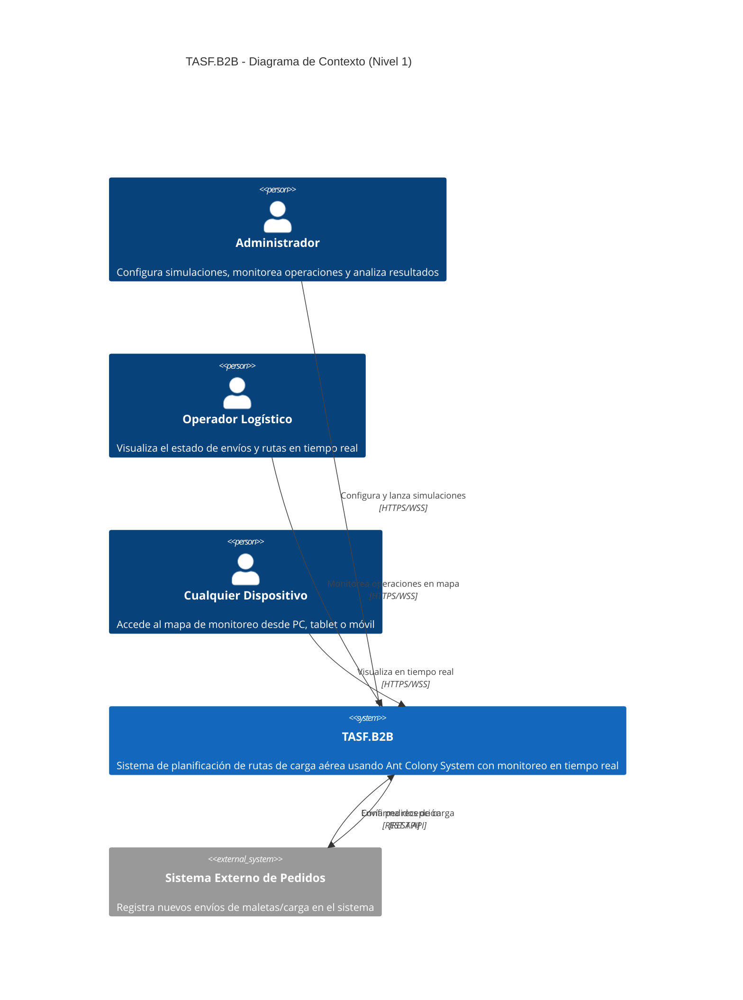
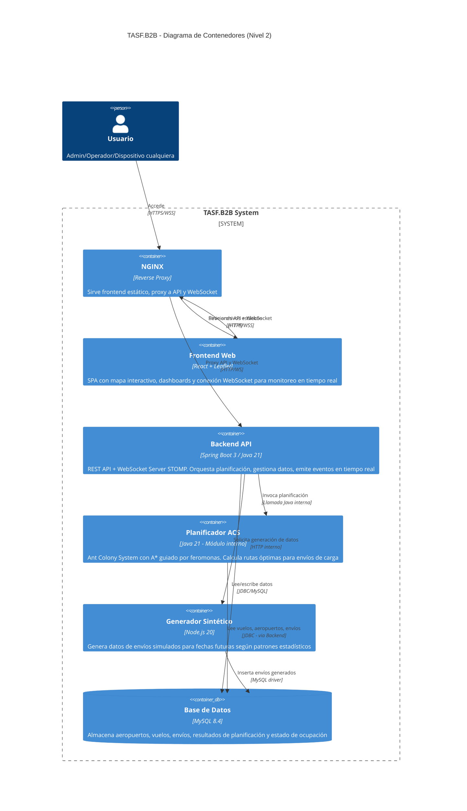
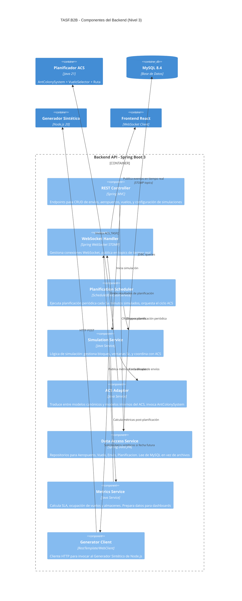
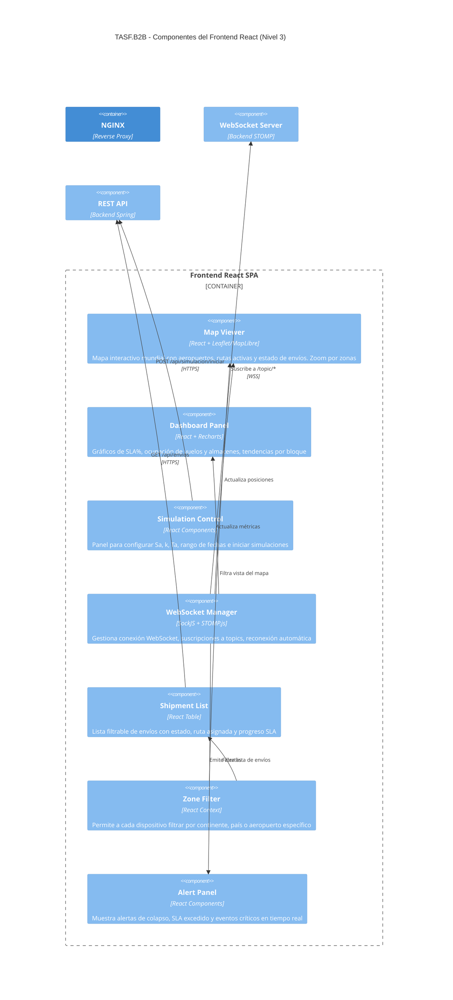

# Análisis Completo: TASF.B2B — Solo ACS + Arquitectura + C4

---

## 1. Archivos necesarios para funcionar SOLO con ACS

Tras analizar todas las dependencias del código, aquí está la clasificación:

### ✅ Archivos a MANTENER (18 archivos .java)

| Archivo | Rol | Notas |
|---|---|---|
| `Main.java` | Punto de entrada | Simplificar: quitar enum AG, dejar solo ACS |
| `Simulador.java` | Orquestador de la simulación | Simplificar: eliminar switch AG/ACS, solo invocar ACS |
| `ACSAdapter.java` | Puente entre estructuras canónicas y ACS | **Esencial** |
| `AntColonySystem.java` | Algoritmo ACS (core) | **Esencial** |
| `VueloSelector.java` | A* guiado por feromonas + selección de vuelos | **Esencial** |
| `FeromonaManager.java` | Conservación de feromonas entre reoptimizaciones | **Esencial** |
| `Ruta.java` | Estado de ruta interna del ACS | **Esencial** |
| `Pedido.java` | Modelo interno ACS (pedido/orden) | **Esencial** |
| `Vuelo.java` | Modelo interno ACS (vuelo) | **Esencial** |
| `Aeropuerto.java` | Modelo interno ACS (aeropuerto) | **Esencial** |
| `Asignacion.java` | Par (Pedido, Vuelo) con flight key | **Esencial** |
| `PlanificationProblemInputACS.java` | Input interno del ACS | **Esencial** |
| `PlanificationSolutionOutputACS.java` | Output interno del ACS | **Esencial** |
| `PlanificationProblemInput.java` | Input canónico (compartido) | Usado por Simulador y ACSAdapter |
| `PlanificationSolutionOutput.java` | Output canónico (compartido) | Usado por Simulador para reportes |
| `ResultadoRuta.java` | Resultado de ruta (vuelos + fechas) | Usado por reportes |
| `Logger.java` | Utilidad de logging | **Esencial** |
| `LectorAeropuertos.java` | Carga aeropuertos desde archivo | Se reemplazará por DAO en el futuro |
| `LectorVuelos.java` | Carga vuelos desde archivo | Se reemplazará por DAO en el futuro |
| `LectorEnvios.java` | Carga envíos desde archivo | Se reemplazará por DAO en el futuro |
| `AeropuertoAlgoritmo.java` | Modelo canónico de aeropuerto | Usado por Simulador y lectores |
| `VueloAlgoritmo.java` | Modelo canónico de vuelo | Usado por Simulador y adaptadores |
| `EnvioAlgoritmo.java` | Modelo canónico de envío | Usado por Simulador y adaptadores |

### ❌ Archivos a ELIMINAR (5 archivos .java)

| Archivo | Razón |
|---|---|
| `AlgoritmoGenetico.java` | Algoritmo AG completo — no se necesita |
| `AGAdapter.java` | Adaptador del AG — no se necesita |
| `Individuo.java` | Cromosoma del AG — no se necesita |
| `NodoRuta.java` | Nodo A* del AG (el ACS tiene su propio `NodoAstar` dentro de `VueloSelector`) |
| `ContadorMaletas.java` | Script utilitario de conteo — no es parte del sistema |

### ❌ Archivos/Carpetas de datos/logs a limpiar

| Archivo | Acción |
|---|---|
| `reporte_ag.txt`, `log_ag.txt` | Eliminar (son outputs del AG) |
| Todos los `.class` | Eliminar (se recompilan) |
| Carpeta `AlgoritmoGenetico/` | Eliminar (versión legacy standalone del AG) |

> [!IMPORTANT]
> Al eliminar el AG, simplifica `Simulador.java` eliminando el `enum Algoritmo`, el `switch` en `ejecutarAlgoritmo()`, y dejando que siempre invoque `ACSAdapter.planificar()`.

---

## 2. Propuesta de Arquitectura

### 2.1 Stack Tecnológico y Asignación de Roles

Con **4GB de RAM** y tu stack, esta es la distribución óptima:

| Componente | Tecnología | RAM estimada | Puerto |
|---|---|---|---|
| **Reverse Proxy** | NGINX 1.24 | ~50 MB | 80/443 |
| **Frontend (build estático)** | React (servido por NGINX) | 0 MB extra | — |
| **Backend API + WebSocket** | Spring Boot 3.x sobre OpenJDK 21 (WAR en Tomcat 10.1) | ~800 MB | 8080 |
| **Módulo Planificador ACS** | Java puro (invocado como servicio interno por el Backend) | ~500 MB (picos) | — |
| **Módulo Generador Sintético** | Node.js 20 (script/servicio) | ~200 MB | 3001 |
| **Base de Datos** | MySQL 8.4 | ~700 MB | 3306 |
| **SO + overhead** | Ubuntu 24.04 | ~500 MB | — |
| **Total estimado** | | **~2.75 GB** | ✅ < 4 GB |

> [!WARNING]
> **Tomcat vs Spring Boot embebido**: Dado que ya tienes Tomcat 10.1 instalado, puedes desplegar un WAR de Spring Boot allí. Sin embargo, si prefieres simplicidad, Spring Boot con Tomcat embebido (un solo JAR) es más fácil de manejar y usa la misma RAM. **Recomiendo Spring Boot con Tomcat embebido** y usar el NGINX como reverse proxy.

### 2.2 Módulos del Sistema

```
┌─────────────────────────────────────────────────────────────┐
│                    MÓDULOS DEL SISTEMA                      │
├─────────────────────────────────────────────────────────────┤
│                                                             │
│  1. FRONTEND (React)                                        │
│     - Dashboard de monitoreo                                │
│     - Mapa interactivo (Leaflet/MapLibre)                   │
│     - Conexión WebSocket para datos en tiempo real          │
│     - Responsive (multi-dispositivo)                        │
│                                                             │
│  2. BACKEND (Spring Boot 3 / Java 21)                       │
│     - REST API para CRUD                                    │
│     - WebSocket Server (STOMP sobre SockJS)                 │
│     - Orquestador de planificación (scheduler)              │
│     - Servicio de métricas y reportes                       │
│                                                             │
│  3. PLANIFICADOR ACS (Java - módulo interno)                │
│     - AntColonySystem + VueloSelector + Ruta                │
│     - Invocado por el Backend como servicio                 │
│     - Ejecuta en thread pool separado                       │
│                                                             │
│  4. GENERADOR SINTÉTICO (Node.js)                           │
│     - Genera datos de envíos para fechas futuras            │
│     - Inserta directamente en MySQL                         │
│     - Invocado por el Backend via HTTP interno              │
│                                                             │
│  5. BASE DE DATOS (MySQL 8.4)                               │
│     - Aeropuertos, vuelos, envíos, resultados               │
│     - Estado de ocupación de vuelos y almacenes             │
│     - Historial de planificaciones                          │
│                                                             │
└─────────────────────────────────────────────────────────────┘
```

### 2.3 Flujo del Sistema (Paso a Paso)

```
FLUJO PRINCIPAL DE PLANIFICACIÓN
═══════════════════════════════════

1. REGISTRO DE PEDIDOS
   Usuario/Sistema externo → NGINX → Backend REST API
   → INSERT en MySQL (tabla `envios`)
   → WebSocket broadcast: "nuevo pedido registrado"

2. GENERACIÓN SINTÉTICA (si la fecha es futura)
   Backend detecta que la fecha de simulación es futura
   → Invoca al Generador Sintético (Node.js) via HTTP
   → Node.js genera envíos según patrones estadísticos
   → INSERT masivo en MySQL
   → Retorna confirmación al Backend

3. PLANIFICACIÓN PERIÓDICA (cada Sa minutos simulados)
   Scheduler del Backend (ScheduledExecutorService)
   → Lee bloque de envíos de MySQL (ventana Sc)
   → Construye PlanificationProblemInput
   → Invoca ACSAdapter.planificar(input, tiempoMs)
     → AntColonySystem ejecuta durante Ta segundos
     → Retorna PlanificationSolutionOutput
   → Persiste resultados en MySQL (tabla `planificaciones`)
   → WebSocket broadcast: resultado del bloque
     {rutas, métricas, ocupación vuelos/almacenes}

4. VISUALIZACIÓN EN TIEMPO REAL
   Frontend React recibe evento WebSocket
   → Actualiza mapa interactivo con rutas activas
   → Actualiza dashboards de métricas (SLA, ocupación)
   → Cada dispositivo conectado ve datos en tiempo real
   → Usuarios pueden filtrar por zona/aeropuerto/envío
```

### 2.4 Comunicación WebSocket — Detalle

```
┌──────────┐         ┌───────┐         ┌─────────────────┐
│ React    │◄──WSS──►│ NGINX │◄──WS───►│ Spring Boot     │
│ Frontend │         │ proxy │         │ (STOMP/SockJS)  │
└──────────┘         └───────┘         └─────────────────┘

Canales WebSocket (Topics STOMP):
─────────────────────────────────
/topic/planificacion   → Resultado de cada bloque ACS
/topic/envios          → Nuevos envíos registrados  
/topic/metricas        → SLA%, ocupación vuelos/almacenes
/topic/mapa            → Posiciones actuales de envíos
/topic/alertas         → Colapsos, SLA excedidos

Interacciones del usuario (por zona):
──────────────────────────────────────
/app/filtro-zona       → El usuario pide ver solo una región
/app/detalle-envio     → Detalle de un envío específico
/user/queue/updates    → Respuestas personalizadas por sesión
```

> [!TIP]
> **¿Por qué STOMP sobre SockJS?** STOMP da estructura a los mensajes WebSocket (topics, suscripciones). SockJS provee fallback automático si WebSocket no está disponible (útil para redes corporativas). Spring Boot tiene soporte nativo con `spring-websocket`.

### 2.5 NGINX como Reverse Proxy

```nginx
# /etc/nginx/sites-available/tasf-b2b
server {
    listen 80;
    server_name tu-dominio.com;

    # Frontend React (archivos estáticos)
    location / {
        root /var/www/tasf-frontend/build;
        try_files $uri $uri/ /index.html;
    }

    # API REST del Backend
    location /api/ {
        proxy_pass http://localhost:8080/api/;
        proxy_set_header Host $host;
        proxy_set_header X-Real-IP $remote_addr;
    }

    # WebSocket del Backend
    location /ws {
        proxy_pass http://localhost:8080/ws;
        proxy_http_version 1.1;
        proxy_set_header Upgrade $http_upgrade;
        proxy_set_header Connection "upgrade";
        proxy_set_header Host $host;
        proxy_read_timeout 86400;  # 24h keepalive
    }

    # Generador sintético (interno, opcional exponerlo)
    location /api/generator/ {
        proxy_pass http://localhost:3001/;
    }
}
```

---

## 3. Diagramas C4

### 3.1 Nivel 1 — Diagrama de Contexto



### 3.2 Nivel 2 — Diagrama de Contenedores



### 3.3 Nivel 3 — Diagrama de Componentes del Backend



### 3.4 Nivel 3 — Componentes del Frontend



---

## 4. Esquema de Base de Datos (MySQL)

```sql
-- Reemplaza la lectura de archivos
CREATE TABLE aeropuerto (
    oaci VARCHAR(4) PRIMARY KEY,
    ciudad VARCHAR(100),
    pais VARCHAR(100),
    continente VARCHAR(50),
    gmt INT,
    capacidad_almacen INT,
    latitud DOUBLE,
    longitud DOUBLE
);

CREATE TABLE vuelo (
    id INT AUTO_INCREMENT PRIMARY KEY,
    origen_oaci VARCHAR(4),
    destino_oaci VARCHAR(4),
    hora_salida TIME,       -- en GMT-0
    hora_llegada TIME,      -- en GMT-0
    capacidad INT,
    FOREIGN KEY (origen_oaci) REFERENCES aeropuerto(oaci),
    FOREIGN KEY (destino_oaci) REFERENCES aeropuerto(oaci)
);

CREATE TABLE envio (
    id VARCHAR(50),
    origen_oaci VARCHAR(4),
    destino_oaci VARCHAR(4),
    fecha_hora_registro DATETIME,  -- en GMT-0
    cantidad_maletas INT,
    cliente_id VARCHAR(50),
    es_sintetico BOOLEAN DEFAULT FALSE,
    PRIMARY KEY (id, origen_oaci),
    FOREIGN KEY (origen_oaci) REFERENCES aeropuerto(oaci),
    FOREIGN KEY (destino_oaci) REFERENCES aeropuerto(oaci)
);

CREATE TABLE planificacion (
    id INT AUTO_INCREMENT PRIMARY KEY,
    iteracion INT,
    fecha_ejecucion DATETIME,
    fecha_inicio_bloque DATETIME,
    fecha_fin_bloque DATETIME,
    total_envios INT,
    total_maletas BIGINT,
    promedio_consumo_sla DOUBLE,
    ocupacion_vuelos DOUBLE,
    ocupacion_almacenes DOUBLE,
    tiempo_ejecucion_ms BIGINT,
    created_at TIMESTAMP DEFAULT CURRENT_TIMESTAMP
);

CREATE TABLE ruta_asignada (
    id INT AUTO_INCREMENT PRIMARY KEY,
    planificacion_id INT,
    envio_id VARCHAR(50),
    envio_origen_oaci VARCHAR(4),
    vuelo_origen VARCHAR(4),
    vuelo_destino VARCHAR(4),
    hora_salida TIME,
    fecha_salida DATE,
    hora_llegada TIME,
    orden_en_ruta INT,
    FOREIGN KEY (planificacion_id) REFERENCES planificacion(id)
);
```

---

## 5. Flujo Visual Completo

```
┌─────────────────────────────────────────────────────────────────────────┐
│                         FLUJO DEL SISTEMA                              │
├─────────────────────────────────────────────────────────────────────────┤
│                                                                         │
│  ┌──────────┐    HTTPS     ┌───────┐    HTTP     ┌──────────────────┐  │
│  │ Browser  │◄────────────►│ NGINX │◄───────────►│ Spring Boot      │  │
│  │ (React)  │    WSS       │ :80   │    WS       │ :8080            │  │
│  └──────────┘              └───────┘             │                  │  │
│       │                                           │  ┌────────────┐ │  │
│       │  Suscribe a topics STOMP                  │  │ Scheduler  │ │  │
│       │  /topic/planificacion                     │  │ (cada Sa)  │ │  │
│       │  /topic/metricas                          │  └─────┬──────┘ │  │
│       │  /topic/mapa                              │        │        │  │
│       │  /topic/alertas                           │        ▼        │  │
│       │                                           │  ┌────────────┐ │  │
│       │                                           │  │ Simulation │ │  │
│       │                                           │  │ Service    │ │  │
│       │                                           │  └──┬───┬─────┘ │  │
│       │                                           │     │   │       │  │
│       │                           ┌───────────────┼─────┘   │       │  │
│       │                           │               │         │       │  │
│       │                           ▼               │         ▼       │  │
│       │                    ┌─────────────┐        │  ┌────────────┐ │  │
│       │                    │ ACS Module  │        │  │ Gen Client │ │  │
│       │                    │ AntColony   │        │  └─────┬──────┘ │  │
│       │                    │ VueloSelect │        │        │        │  │
│       │                    │ Ruta        │        │        │ HTTP   │  │
│       │                    └─────────────┘        │        ▼        │  │
│       │                                           │  ┌────────────┐ │  │
│       │                                           │  │ Node.js    │ │  │
│       │                                           │  │ Generator  │ │  │
│       │                                           │  │ :3001      │ │  │
│       │                                           │  └─────┬──────┘ │  │
│       │                                           │        │        │  │
│       │                                           └────────┼────────┘  │
│       │                                                    │           │
│       │                                                    ▼           │
│       │                                             ┌────────────┐    │
│       │                                             │  MySQL 8.4 │    │
│       │                                             │  :3306     │    │
│       └─────────────────────────────────────────────┤            │    │
│                                                     │ aeropuerto │    │
│         Cualquier dispositivo puede conectarse      │ vuelo      │    │
│         al mismo sistema via navegador web          │ envio      │    │
│                                                     │ planific.  │    │
│                                                     │ ruta_asig. │    │
│                                                     └────────────┘    │
└─────────────────────────────────────────────────────────────────────────┘
```

---

## Open Questions

> [!IMPORTANT]
> **Generador Sintético**: ¿Qué patrones o distribuciones estadísticas usarías para generar los envíos sintéticos? ¿Se basan en datos históricos reales o hay una fórmula específica del curso?

> [!IMPORTANT]
> **Simulación vs Tiempo Real**: ¿El sistema final opera en modo **simulación** (procesar datos históricos/futuros aceleradamente) o en modo **tiempo real** (esperar Sa minutos reales entre planificaciones)? Esto impacta cómo funciona el scheduler.

> [!IMPORTANT]
> **Tomcat standalone vs embebido**: ¿Prefieres desplegar un WAR en tu Tomcat 10.1 existente, o usar Spring Boot con Tomcat embebido (un solo JAR ejecutable)? Recomiendo embebido por simplicidad.

> [!IMPORTANT]
> **Librería de mapa**: ¿Tienes preferencia entre Leaflet (más ligero, gratuito) o MapLibre GL (vectorial, más moderno)? Ambos funcionan bien con React.

## Verification Plan

### Automated Tests
- Compilar el proyecto solo con los archivos ACS y verificar que no hay errores
- Ejecutar la simulación ACS y comparar métricas con la versión actual

### Manual Verification
- Validar los diagramas C4 con el equipo del curso
- Revisar que el esquema de BD cubre todos los datos que actualmente se leen de archivos
